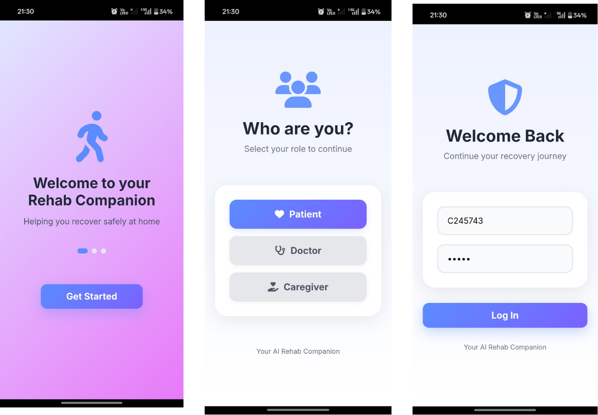
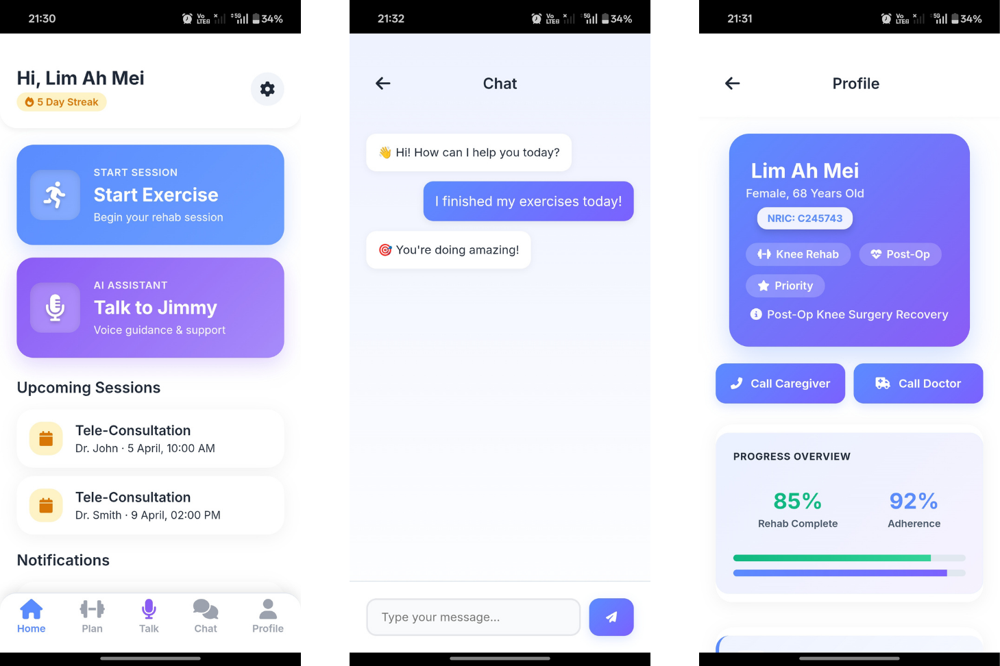
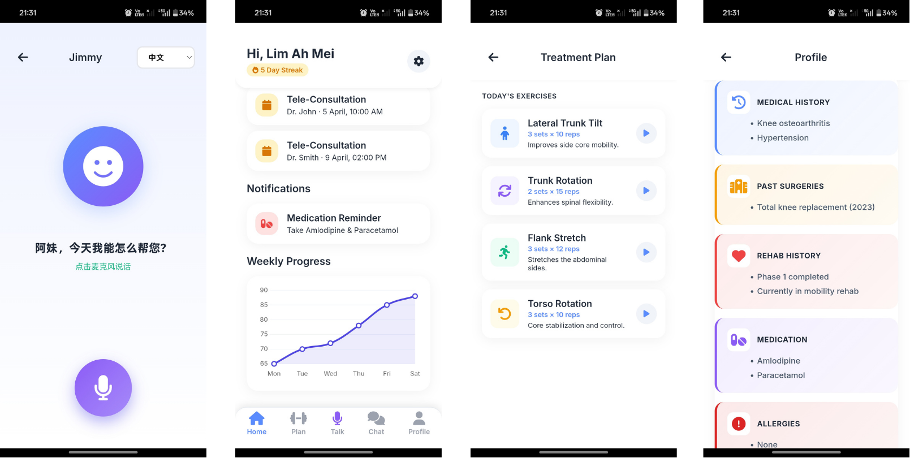

# SHA2 Innovation Challenge - IC 2026

## Multimodal Home Rehab Form Coach (MSK / Post-op Rehab)

**Target Users:** Outpatient / post-op / musculoskeletal (MSK) patients needing rehabilitation.

**Key Features:**
- Detects exercises → counts reps/sets, checks form quality, flags mistakes
- Real-time guidance: "knees tracking inward", "slow down", "stand taller"
- Generates clinician-ready summary: adherence %, quality trend, top errors, "needs intervention" flags
- Personalized feedback based on baseline range-of-motion and progressive targets
- Multi-lingual cues: SEA-LION can give audio/text instructions in different languages

### Multimodal Inputs
- **Video:** Pose/joint angles (primary) using MediaPipe / MoveNet
- **Audio:** Optional effort/pain check
- **Patient-reported:** Pain/perceived exertion
- **Optional Wearables:** Smoothness, stability

### MVP
- On-device pose extraction
- Rule-based checks for exercise form


## Setup Guide & Steps

For the latest setup instructions and deployment steps, please see:
[Setup & Deployment Guide (Google Doc)](https://docs.google.com/document/d/1qvcju2KoFT-kRUrpA6qwuMHvGF9V89HACPjtdlyOOrw/edit?tab=t.0)


# SHA2 Innovation Challenge - IC 2026

## Multimodal Home Rehab Form Coach

### Project Overview
This project is a modern, multimodal rehabilitation platform for outpatient and post-op MSK patients. It provides real-time exercise feedback, personalized progression, and clinician-ready summaries.

---

## Visual Overview

> **Python 3.11 is required.** MediaPipe and TensorFlow are not compatible with Python 3.12 or later. Verify your version with `python3 --version` before proceeding.

### 1. Clone the Repository
```bash
git clone https://github.com/swathika1/SHA2_innovation_challenge.git
cd SHA2_innovation_challenge
```

### 2. Create a virtual environment

Linux / Mac:
```bash
python3 -m venv venv
source venv/bin/activate
```

Windows (PowerShell):
```bash
python -m venv venv
.\venv\Scripts\Activate.ps1
```

### 3. Install dependencies
```bash
pip install --upgrade pip
pip install -r requirements.txt
```

### 4. Configure environment variables

Copy the example env file and fill in your credentials:

```bash
cp .env.example .env
```

Then open `.env` and set the following variables:

| Variable | Required | Description |
|---|---|---|
| `GROQ_API_KEY` | Yes | Groq API key — get from [console.groq.com](https://console.groq.com) |
| `MERILION_API_KEY` | Yes | MERaLiON API key from cr8lab |
| `MERILION_USERNAME` | Yes | MERaLiON account username |
| `MERILION_BASE_URL` | Yes | Default: `https://api.cr8lab.com` |
| `GROQ_MODEL` | Yes | Default: `llama-3.1-8b-instant` |
| `FLASK_SECRET_KEY` | Yes | Any long random string — used to sign session cookies |
| `NOTIFY_EMAIL_SENDER` | No | Gmail address for session alert emails |
| `NOTIFY_EMAIL_PASSWORD` | No | Gmail app password (not your account password) |

> Without `GROQ_API_KEY` and `MERILION_API_KEY` the app will start but AI feedback and the Jimmy chatbot will not function.

### 5. Download ML model files

Download the full model files from Google Drive and place them inside `Rehab_Scorer_Coach/models/`:

**[Download models (Google Drive)](https://drive.google.com/drive/folders/1tNtTbmkIOcD_DPkIV7chTlQfDga6GPsX?usp=sharing)**

| File | Purpose |
|---|---|
| `poseformer_transformer_model.keras` | Pose quality regression model |
| `scoring_model.keras` | Frame-level score scaler model |
| `mobilenet_exercise_model.keras` | Exercise classification model |
| `x_scaler.pkl` | Input feature scaler |
| `y_map.pkl` | Output label map |
| `scoring_scaler.pkl` | Score normalisation scaler |
| `exercise_scaler.pkl` | Exercise feature scaler |
| `exercise_label_map.json` | Exercise class index map |

### 6. Initialise the database (first run only)

```bash
python init_database.py
```

This creates `rehab_coach.db` with all required tables and default seed data. Skip if `rehab_coach.db` already exists.

### 7. Build the RAG knowledge base (first run only)

```bash
python knowledge_loader.py --all
```

This ingests KIMORE exercise guides, PDF documents, and the exercise library into the local FAISS vector store used by the AI feedback pipeline. Skip if the `rag_db/` directory already exists and is populated.

### 8. Run the app

Linux / Mac:
```bash
python3 main.py
```

Windows:
```bash
python main.py


App runs on: `http://localhost:5050`
```

## Mobile App 
=======
<p align="center">
  
</p>

<p align="center">
  
</p>


<p align="center">
  
</p>


---

Two parallel rehab pipelines run depending on the exercise type:

```
┌──────────────────────────────────────────────────────────────────────────┐
│  VIDEO CAPTURE → Base64 Encode → POST /api/live_feedback                 │
└──────────────────────────────────────────────────────────────────────────┘
                              │
               ┌──────────────┴──────────────┐
               ▼                             ▼
  ┌─────────────────────────┐   ┌─────────────────────────┐
  │  WebRehabPipeline       │   │  KeraalRehabPipeline     │
  │  (KIMORE - 8 exercises) │   │  (Low back pain - 3 ex.) │
  │                         │   │                          │
  │  MediaPipe (33 pts)     │   │  MediaPipe (33 pts)      │
  │  → 50D feature vector   │   │  → Pose buffer (48 frames)│
  │  → Exercise classifier  │   │  → Exercise classifier   │
  │  → Score model (0-50)   │   │  → Correctness model     │
  │  → RepCounter (angles)  │   │  → RepCounter (angles)   │
  └─────────────────────────┘   └─────────────────────────┘
               │                             │
               └──────────────┬──────────────┘
                              ▼
              ┌───────────────────────────────┐
              │  API Response                 │
              │  {                            │
              │    frame_score: 34.5,         │
              │    form_status: "CORRECT",    │
              │    exercise_name: "squat",    │
              │    rep_info: {                │
              │      rep_now: 5,              │
              │      rep_target: 10,          │
              │      set_now: 1,              │
              │      set_target: 3,           │
              │      rep_incremented: true,   │
              │      set_completed: false,    │
              │      exercise_completed: false│
              │    },                         │
              │    landmarks: [[x,y,z]×33],   │
              │    llm_feedback: [...]        │
              │  }                            │
              └───────────────────────────────┘
```

### Rep Detection
Rules-based using MediaPipe joint angles:
- Squat: knee angle < 90° (down) → > 160° (up)
- Arm Lifting: shoulder-wrist distance high → low
- Lateral Tilt: side asymmetry > 15%
- ...and more per exercise

### Skeleton Visualization
Frontend polls `GET /api/session/landmarks` every 200ms independently of the main feedback loop. Returns the latest 33 landmark points for real-time skeleton overlay on canvas.

### Gamification
Badge unlocks tracked client-side based on total reps:
- First Step (≥1 rep)
- One Set (≥10 reps)
- Pair Power (≥20 reps)
- Champion (≥30 reps)
- Fully responsive mobile UI for patient session tracking
- Camera and microphone support for real-time feedback
- Streamlined pain/effort check-in after each session
- Push notifications for session reminders (if enabled)
- Optimized for both Android and iOS browsers

---
## Database

DB design:


## Contact

For questions or demo requests, please contact the project team.
- hrithik.kannan.krishnan@u.nus.edu
- swathika_k@u.nus.edu
